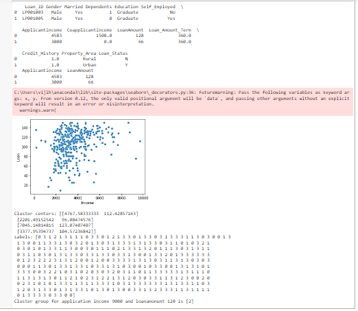

# Implementation of K-Means Clustering Algorithm
## Aim
To write a python program to implement K-Means Clustering Algorithm.
## Equipment’s required:
1.	Hardware – PCs
2.	Anaconda – Python 3.7 Installation

## Algorithm:
### Step1: 
Import pandas as pd.
### Step2: 
Read the csv file.
### Step3: 
Get the value of X and y variables.
### Step4: 
Create the linear regression model and fit.
### Step5: 
Predict the CO2 emission of a car where the weight is 2300kg, and the volume is 1300cm3.
### Step6: 
Print the predicted output.

## Program:
```
import pandas as pd
from sklearn.cluster import KMeans
import matplotlib.pyplot as plt
import seaborn as sns
x1=pd.read_csv('clustering.csv')
print(x1.head(2))
x2=x1.loc[:,['ApplicantIncome','LoanAmount']]
print(x2.head(2))

x=x2.values
#print(x)
sns.scatterplot(x[:,0],x[:,1])
plt.xlabel('Income')
plt.ylabel('Loan')
plt.show()

kmeans=KMeans(n_clusters=4)
kmeans.fit(x)
print("Cluster centers:",kmeans.cluster_centers_)
print("Labels:",kmeans.labels_)
predict_class=kmeans.predict([[9000,1200]])
print("Cluster group for application income 9000 and loanamonunt 120 is",predict_class)


```
## Output:

### Insert your output
```
 Loan_ID Gender Married Dependents Education Self_Employed  \
0  LP001003   Male     Yes          1  Graduate            No   
1  LP001005   Male     Yes          0  Graduate           Yes   

   ApplicantIncome  CoapplicantIncome  LoanAmount  Loan_Amount_Term  \
0             4583             1508.0         128             360.0   
1             3000                0.0          66             360.0   

   Credit_History Property_Area Loan_Status  
0             1.0         Rural           N  
1             1.0         Urban           Y  
   ApplicantIncome  LoanAmount
0             4583         128
1             3000          66
C:\Users\vijih\anaconda3\lib\site-packages\seaborn\_decorators.py:36: FutureWarning: Pass the following variables as keyword args: x, y. From version 0.12, the only valid positional argument will be `data`, and passing other arguments without an explicit keyword will result in an error or misinterpretation.
  warnings.warn(

Cluster centers: [[4767.58333333  112.42857143]
 [2201.49152542   96.08474576]
 [7045.14814815  123.07407407]
 [3377.95394737  104.57236842]]
Labels: [0 3 1 2 1 3 1 1 1 0 3 3 0 1 2 1 3 3 0 1 3 3 0 3 1 3 3 3 1 1 3 0 3 0 0 1 3
 1 3 0 0 1 1 3 3 1 3 0 3 2 0 1 3 0 3 1 3 3 3 1 3 1 3 3 0 3 1 1 0 1 0 3 2 1
 0 3 0 1 0 1 3 3 1 1 3 0 0 3 0 1 1 1 0 2 1 3 3 1 3 2 0 1 1 1 3 0 3 1 3 1 1
 0 3 1 1 0 3 0 1 3 1 3 3 0 3 3 1 3 3 0 3 3 1 3 0 0 1 3 3 2 0 1 3 3 3 3 3 3
 0 1 2 3 2 2 2 3 1 3 1 2 0 0 1 2 0 0 3 3 3 3 1 3 1 3 0 3 1 1 3 1 3 0 3 0 3
 0 0 0 1 1 3 0 1 3 3 1 3 3 1 0 3 3 1 3 1 0 3 0 0 1 0 3 3 0 0 1 3 1 3 1 0 1
 3 3 3 0 0 3 2 2 1 0 3 1 0 2 0 3 0 3 2 0 3 1 1 0 1 1 3 3 3 3 3 1 3 1 1 1 0
 1 1 3 1 3 1 3 0 1 1 2 1 0 2 3 1 2 2 1 3 1 2 0 3 0 3 3 1 1 3 1 2 3 0 0 2 0
 0 2 3 1 0 1 0 1 3 3 1 1 3 1 1 3 3 3 1 0 3 1 3 3 3 3 3 3 1 3 1 3 3 1 1 0 3
 1 2 0 3 1 3 3 0 1 3 1 3 3 1 0 1 3 0 1 3 0 0 3 3 1 3 2 3 3 3 1 1 3 1 1 1 1
 0 1 3 3 3 3 0 3 3 0 0]
Cluster group for application income 9000 and loanamonunt 120 is [2]
```

## Result
Thus the K-means clustering algorithm is implemented and predicted the cluster class using python program.